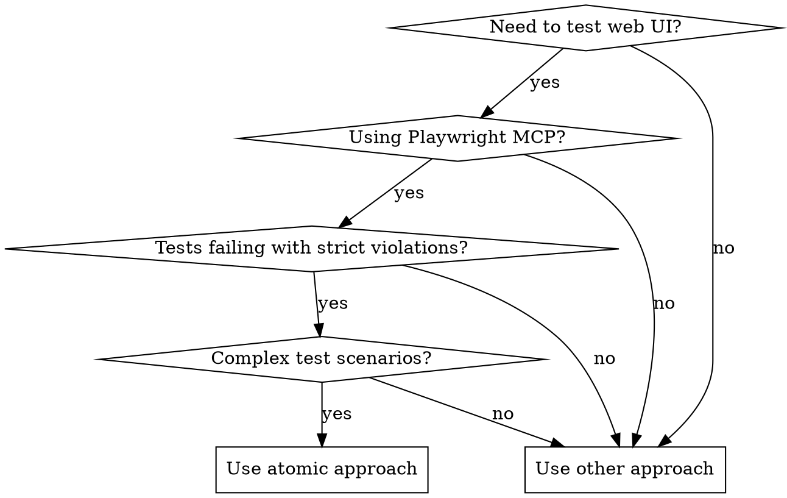
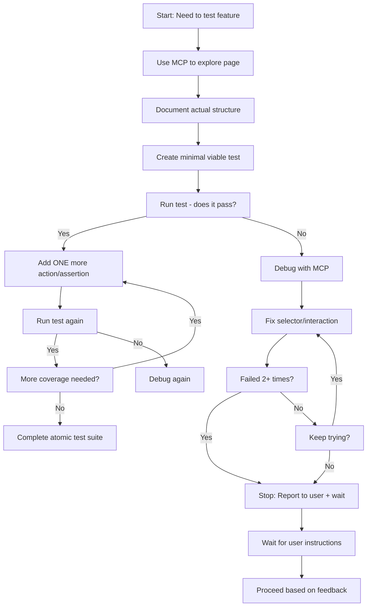

# Generating UI Tests with Playwright MCP

## Overview

**Atomic test creation beats comprehensive complexity.** This skill enforces incremental development: 1-2 actions/assertions per test, verify each works before building complexity, never assume page structure without exploration.

## Key Operating Principles

- **Always work in small atomic iterations** - implement 1-2 actions/assertions/atomic changes
- **Verify it works** - run test after each change
- **Ask for user feedback** - stop and wait for permission to proceed
- **Stop after 2 failures or 1 minute** - when troubleshooting issues, report to user and wait for instructions
- **Use proper test flags** - always run with `--project=chromium --trace on --retries=0 --headed`
- **Single responsibility principle** - one scenario per test, no comprehensive test files

## When to Use



**Use when:**

- Tests fail with "strict mode violation" errors
- Registration forms have unexpected labels/structure
- Navigation elements need complex workarounds
- Tests timeout waiting for assumed elements
- Multiple test steps make debugging impossible
- Tests use `page.goto()` repeatedly to reset state

**Don't use when:**

- Simple static pages with known structure
- Tests already passing reliably
- No MCP server available
- Page objects required (different pattern)

## Core Pattern

**Before (Agent Under Pressure):**

```typescript
// ❌ Complex test with assumptions
test("should validate home page navigation and functionality", async ({
  page,
}) => {
  await page.goto("https://scoolendar.com/");
  // 20+ lines of complex interactions
  await expect(page.getByLabel("First name")).toBeVisible(); // FAILS - wrong assumption
});
```

**After (Atomic Approach):**

```typescript
// ✅ Single action, single assertion
test("should navigate to home page tc-001", async ({ page }) => {
  await test.step("Navigate and verify URL", async () => {
    await page.goto("https://scoolendar.com/");
    await expect(page).toHaveURL(/scoolendar\.com/);
  });
});
```

## Quick Reference

| Situation             | Atomic Approach                        | Common Pitfall           |
| --------------------- | -------------------------------------- | ------------------------ |
| **Page exploration**  | Use MCP to discover structure first    | Assume elements exist    |
| **Form testing**      | Test one field per test                | Test entire form at once |
| **Navigation**        | One click per test, verify URL         | Complex multi-step flows |
| **Strict violations** | See explanation below                  |
| **Timeout issues**    | Add specific waits for dynamic content | Use arbitrary timeouts   |

## Testing Methodology

### Test Structure Requirements

1. **Always use test.step()** for organizing test actions into clear, logical phases
2. **Structure tests with Setup, Action, and Verification phases**
3. **Use descriptive, user-focused test names** that clearly state the expected outcome
4. **Implement proper waits and assertions** using Playwright's built-in mechanisms
5. **Include visual-only tests** - for each page, at least one test that checks only the visual aspect without interacting with the page
6. **Cover both positive and negative scenarios** with meaningful assertions
7. **Follow single responsibility principle** - one scenario per test

### Test File Organization

- **Imports**: Start with `import { test, expect } from '@playwright/test';`
- **Organization**: Group related tests for a feature under a `test.describe()` block
- **Hooks**: Use `beforeEach` for setup actions common to all tests in a `describe` block (e.g., navigating to a page)
- **Titles**: Follow clear naming convention, such as `feature - specific action or scenario`
- **Location**: Store all test files in the `tests/` directory
- **Naming**: Use `<feature-or-page>.spec.ts` format (e.g., `login.spec.ts`, `search.spec.ts`)
- **Scope**: Aim for one test file per major application feature or page

### Code Quality Standards

- **Write clean, readable TypeScript code** following the project's formatting standards
- **Use meaningful variable names** and add comments when necessary
- **Include proper error handling** and retry mechanisms where needed
- **Ensure tests are independent** and can run in any order
- **Follow accessibility best practices** in selector choices
- **Use auto-retrying web-first assertions** - start with `await` keyword
- **Avoid hard-coded waits** - rely on Playwright's built-in auto-waiting mechanisms
- **Use descriptive test and step titles** (all lowercase) that clearly state the intent

## Implementation

### Step 1: Explore Before Testing

**ALWAYS use MCP to understand page structure:**

```typescript
// 1. Use MCP browser tools to explore
await mcp__playwright__browser_navigate("https://scoolendar.com/");
await mcp__playwright__browser_snapshot();

// 2. Document actual structure found
// - Preloader exists: #preloader
// - Hero title: .home_header_title
// - Registration has: First name, Last name, Email, Zip code
// - Navigation: Toggle button with complex selector
```

### Step 2: Create Minimal Viable Test

**Start with absolute minimum:**

```typescript
import { test, expect } from "@playwright/test";

test.describe("home page", () => {
  test("should load home page tc-001", async ({ page }) => {
    await test.step("Navigate and verify basic elements", async () => {
      await page.goto("https://scoolendar.com/");
      await expect(page).toHaveURL(/scoolendar\.com/);
    });
  });
});
```

### Step 3: Build Incrementally

**Add ONE action/assertion at a time:**

```typescript
test("should handle preloader tc-002", async ({ page }) => {
  await test.step("Wait for preloader to disappear", async () => {
    await page.goto("https://scoolendar.com/");

    if (await page.locator("#preloader").isVisible()) {
      await expect(page.locator("#preloader")).toBeHidden({ timeout: 10000 });
    }
  });
});
```

### Step 4: Handle Strict Mode Violations

**Be explicit about element selection:**

```typescript
// ❌ BAD: Ambiguous selector, resolves to 2 elements
await expect(page.locator('p:has-text("SCOOLENDAR")')).toBeVisible();

// ❌ BAD: Relies on DOM structure, violates recommendation "prioritizing user-facing attributes and explicit contracts"
await expect(
  page.locator('p.home_header_title:has-text("SCOOLENDAR")')
).toBeVisible();
// ❌ BAD: `.first()` is not robust locator, because the order of elements can change
await expect(page.locator('p:has-text("SCOOLENDAR")').first()).toBeVisible();
```

// ✅ GOOD: Pprioritizes user-facing attributes and explicit contracts, usess recommended "filtering locators" approach.
`page.getByText("SCOOLENDAR") or page.getByRole('presentation', { name: "SCOOLENDAR" })` # step 1: use 'naive' approach following best practices prioritizing user-facing attributes and explicit contracts
`page.locator('section').filter({hasText: /smart and cool calendar/i}) ` # step 2: target nearest parent element, again following best practices prioritizing user-facing attributes and explicit contracts
`page.locator('section').filter({hasText: /smart and cool calendar/i}).getByText("SCOOLENDAR") ` # step 3: combine results from steps 1 and 2 to get unique locator
`await expect(page.locator('section').filter({hasText: /smart and cool calendar/i}).getByText("SCOOLENDAR")).toBeVisible();` # step 4: verify by running the test and confirming this step passed 2. Step 5: When you TRIED but was not able to use "filtering locators" approach, read this `[guide](https://playwright.dev/docs/locators#locating-elements)` and follow recommendations to find the approach that works 3. As a last resort, use `.first()`, `.last()` or `.nth()` methods. ALWAYS highlight this for user with 1 line explanation.

### Step 5: Use Web-First Assertions and Accessible Locators

**Prioritize auto-retrying assertions and user-facing locators:**

```typescript
// ✅ GOOD: Auto-retrying assertions with role-based locators
await expect(page.getByRole('heading', { name: 'Welcome' })).toBeVisible();
await expect(page.getByLabel('Email')).toHaveValue('test@example.com');

// ⚠️  USE ONLY for testing visibility changes
await expect(page.getByRole('dialog')).toBeVisible();
await expect(page.getByRole('status', { name: 'Loading' })).toBeHidden();

// ❌ BAD: Hard-coded waits and CSS-first selectors
await page.waitForTimeout(3000); // Don't do this
await expect(page.locator('.submit-btn')).toBeVisible(); // Use getByRole instead
```

**Locator Priority Order:**
1. **Role-based**: `getByRole()`, `getByLabel()`, `getByPlaceholder()`
2. **Text-based**: `getByText()`, `getByTitle()`
3. **Test-specific**: `getByTestId()`, `getByAltText()`
4. **CSS selectors**: Only as last resort

### Step 6: Assertion Best Practices

**Use the right assertion for the right purpose:**

| Purpose | Best Assertion | Example |
|---------|----------------|---------|
| **UI Structure** | `toMatchAriaSnapshot()` | `await expect(page.locator('.header')).toMatchAriaSnapshot();` |
| **Element Counts** | `toHaveCount()` | `await expect(page.locator('.item')).toHaveCount(3);` |
| **Text Content** | `toHaveText()` for exact, `toContainText()` for partial | `await expect(page.locator('.title')).toHaveText('Welcome');` |
| **Navigation** | `toHaveURL()` | `await expect(page).toHaveURL(/dashboard/);` |
| **Visibility** | `toBeVisible()` (only for visibility changes) | `await expect(page.locator('.modal')).toBeVisible();` |
| **Presence** | `toBeAttached()` | `await expect(page.locator('.dynamic')).toBeAttached();` |

## Context Strategy

### File Discovery Approach

**Start lightweight, drill down when needed:**

```bash
# 1. Use @directory/ for file listings
@directory/

# 2. Drill down to specific files only when needed
@directory/tests/e2e/home/

# 3. Use grep and glob for targeted searches
@glob tests/**/*.spec.ts
@grep "test.describe" tests/
```

### Metadata-Based Filtering

**Use file metadata for relevance:**

- **Modification dates** - focus on recently changed files
- **File sizes** - large files may need chunking
- **Naming patterns** - identify feature areas by file names
- **Folder structure** - understand component relationships

### Lightweight References

**Keep references minimal until detail needed:**

```typescript
// ✅ GOOD: Bookmark paths for later use
const homePageTests = '/tests/e2e/home/home-page-basic.spec.ts';

// ❌ BAD: Load entire file content unnecessarily
const fullContent = await Read('/tests/e2e/home/home-page-basic.spec.ts');
```

### File Organization Guidelines

**Store tests in proper locations:**

- **Location**: Store all test files in the `tests/` directory
- **Naming**: Use `<feature-or-page>.spec.ts` format (e.g., `login.spec.ts`, `search.spec.ts`)
- **Scope**: Aim for one test file per major application feature or page
- **Structure**: Organize according to project folder structure (home/, auth/, events/, community/, navigation/, shared/)

## Output Format Requirements

### Test File Output

**Provide complete, ready-to-run test files:**

```typescript
// ✅ COMPLETE: Full test file with imports and setup
import { test, expect } from '@playwright/test';

test.describe('registration flow', () => {
  test('should navigate to registration page tc-001', async ({ page }) => {
    await test.step('click get started button', async () => {
      await page.goto('https://scoolendar.com/');
      await page.getByRole('link', { name: 'Get Started Now' }).click();
      await expect(page).toHaveURL(/register/);
    });
  });
});
```

### Strategy Explanations

**Add brief explanations for complex scenarios:**

- When introducing multi-step flows, explain the testing strategy
- When using specific locator approaches, explain the reasoning
- When handling dynamic content, explain the wait strategy

### Edge Case Suggestions

**Suggest additional test coverage:**

```typescript
// Consider adding these test cases:
// - Empty form validation
// - Invalid email format handling
// - Mobile responsive behavior
// - Accessibility compliance
```

## Clarification Triggers

### Always Ask For Clarification When

**Missing critical information:**

- **Target application URL or environment** not specified
- **Test requirements** ambiguous or incomplete
- **User preferences** for test coverage or specific scenarios unclear
- **Integration considerations** with existing test suites or dependencies

### Examples of Clarification Requests

```
"I need more information to create effective tests:
- What is the target URL/environment for testing?
- Are there specific user flows or features to focus on?
- Do you need both positive and negative test scenarios?
- Should I integrate with existing test files or create new ones?"
```

### When to Proceed Without Clarification

**You have enough context when:**

- URL is clearly specified or can be inferred
- Test requirements are specific and actionable
- User has provided examples or clear expectations
- Integration requirements are understood

## Quality Checklist

**Before finalizing tests, ensure:**

- [ ] All locators are accessible and specific and avoid strict mode violations
- [ ] Tests are grouped logically and follow a clear structure
- [ ] Assertions are meaningful and reflect user expectations
- [ ] Tests follow consistent naming conventions
- [ ] Code is properly formatted and commented
- [ ] Tests are independent and can run in any order
- [ ] Visual-only tests are included for each page
- [ ] Both positive and negative scenarios are covered
- [ ] Auto-retrying assertions are used instead of hard-coded waits
- [ ] Role-based locators are prioritized over CSS selectors

## Common Mistakes

| Mistake                    | Why it happens                       | Fix                                                                                                                           |
| -------------------------- | ------------------------------------ | ----------------------------------------------------------------------------------------------------------------------------- |
| **Assuming form labels**   | "First name" seems standard          | Use MCP to verify actual labels                                                                                               |
| **Complex workarounds**    | Navigation toggle doesn't work       | Test simple interactions first                                                                                                |
| **Not using .filtering()** | Causes strict mode violation" error. | Use "filtering locators" approach and recommended methods in docs `[guide](https://playwright.dev/docs/locators#quick-guide)` |
| **Repeated page.goto()**   | Easy state reset                     | Use test isolation instead                                                                                                    |
| **Long test steps**        | "Comprehensive" mindset              | One specific action per step                                                                                                  |
| **No preloader handling**  | Pages load quickly locally           | Always wait for dynamic content                                                                                               |
| **Hard-coded waits**       | Impatience with timing               | Use auto-retrying assertions and proper waits                                                                                 |
| **CSS-first selectors**    | Familiarity with CSS                 | Prioritize role-based and text-based locators                                                                                 |
| **No visual tests**        | Focus on functionality only          | Include at least one visual-only test per page                                                                                |

## Red Flags - STOP and Start Over

**When you see these patterns, stop immediately and restart with atomic approach:**

- Writing "comprehensive test" with multiple scenarios in one test
- Using `page.goto()` to reset state between test steps
- Creating complex fallback logic for element selection
- Assuming form labels without MCP exploration
- Writing tests with more than 2 actions/assertions per step
- Ignoring strict mode violations with "it should work"

**All of these mean: Delete the test. Start over with atomic approach.**

## Rationalization Counter

| Excuse | Reality | Atomic Approach |
|--------|---------|-----------------|
| "I need comprehensive test coverage" | Complex tests hide failures and are impossible to debug | Build coverage incrementally: one working test at a time |
| "First name is standard label" | Pages have custom implementations - verify with MCP first | Use MCP to explore actual form structure before testing |
| "Complex workaround needed for navigation" | Workarounds indicate you don't understand the page structure | Test simple, reliable interactions first |
| "Tests pass locally, fail in CI" | Different load times and race conditions | Handle dynamic content explicitly with proper waits |
| "Strict mode violation is just a warning" | It's a test failure - multiple elements match your selector | Use filtering locators approach to create unique selectors |
| "page.goto() is easiest reset" | Creates slow, unreliable tests with side effects | Design atomic tests that don't need state reset |
| "Time pressure - just get it working" | Broken tests waste more time than atomic development | Invest in solid foundation, build incrementally |

## MCP Usage Guidelines

### When to Use MCP Browser Tools

**Use MCP for:**
- **Page structure discovery** - Before writing any test
- **Element validation** - Verify selectors actually exist
- **Complex interaction testing** - Multi-step flows that are hard to script
- **Dynamic content behavior** - See how elements load/change
- **Visual testing** - Screenshots and layout verification

**Don't use MCP for:**
- Simple static pages with known structure
- Performance-critical test suites
- When direct Playwright API is sufficient

### MCP Workflow Pattern

```typescript
// 1. Discovery Phase (use MCP)
await mcp__playwright__browser_navigate('https://scoolendar.com/');
await mcp__playwright__browser_snapshot();
// Document findings: preloader, form labels, navigation structure

// 2. Test Creation Phase (use Playwright API)
test('should handle registration form tc-005', async ({ page }) => {
  await test.step('Navigate to registration', async () => {
    await page.goto('https://scoolendar.com/');
    await page.getByRole('link', { name: 'Get Started Now' }).click();
  });

  await test.step('Verify form fields', async () => {
    await expect(page.getByLabel('First name')).toBeVisible();
    // Only test ONE field per atomic test
  });
});

// 3. Validation Phase (use MCP if test fails)
if (testFails) {
  await mcp__playwright__browser_navigate('https://scoolendar.com/register');
  await mcp__playwright__browser_snapshot();
  // Debug why selector doesn't match
}
```

### MCP Commands Reference

| MCP Command | When to Use | What it Returns |
|-------------|-------------|-----------------|
| `mcp__playwright__browser_navigate()` | Initial page exploration | Page load status |
| `mcp__playwright__browser_snapshot()` | Element discovery | Accessibility tree |
| `mcp__playwright__browser_click()` | Complex interaction testing | Action result |
| `mcp__playwright__browser_take_screenshot()` | Visual validation | Screenshot file |

## Testing Workflow

### Complete Atomic Test Creation Process



### Step-by-Step Example

**Step 1: MCP Exploration**
```bash
# Use MCP to understand registration form
await mcp__playwright__browser_navigate('https://scoolendar.com/');
await mcp__playwright__browser_click('Get Started Now');
await mcp__playwright__browser_snapshot();
# Discovery: Form has 'First name', 'Last name', 'Email', 'Zip code' labels
```

**Step 2: Create First Atomic Test**
```typescript
test('should navigate to registration page tc-001', async ({ page }) => {
  await test.step('Click CTA and verify navigation', async () => {
    await page.goto('https://scoolendar.com/');
    await page.getByRole('link', { name: 'Get Started Now' }).click();
    await expect(page).toHaveURL(/register/);
  });
});
```

**Step 3: Verify Test Passes, Add Next Atomic Test**
```typescript
test('should show first name field tc-002', async ({ page }) => {
  await test.step('Navigate and verify first name field', async () => {
    await page.goto('https://scoolendar.com/');
    await page.getByRole('link', { name: 'Get Started Now' }).click();
    await expect(page.getByLabel('First name')).toBeVisible();
  });
});
```

**Continue until complete coverage, one atomic test at a time.**

## Real-World Impact

**Before skill:** 2 failed tests, strict mode violations, timeouts

- 245 lines of complex test code
- Multiple assumptions about page structure
- Tests failing after 9.6s and 3.1s

**After skill:** Individual passing tests, reliable assertions

- 15-20 lines per focused test
- Verified element structure
- Atomic debugging, faster feedback
